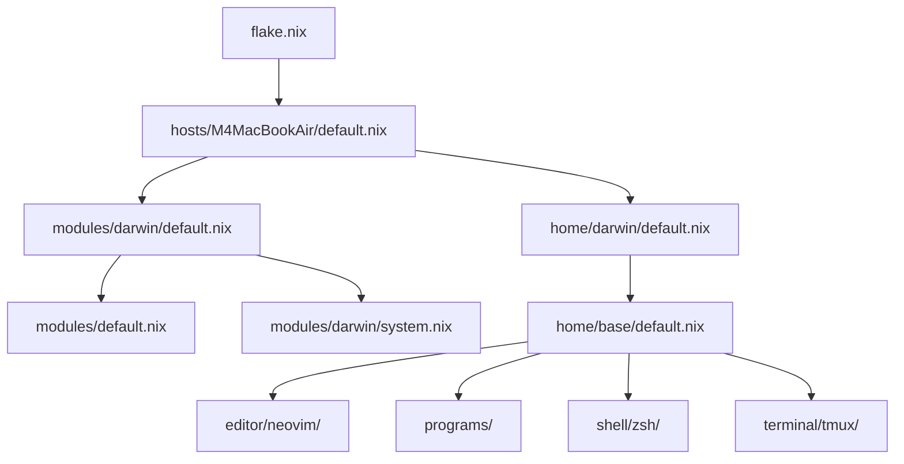

# Architecture

## モジュール依存関係

## 各層の役割

### flake.nix

リポジトリ全体のエントリーポイントにあたる。nixpkgs, nix-darwin, home-manager, neovim-nightly-overlay などの inputs を定義し、darwinConfigurations を出力する。

### hosts/

マシンごとの設定を置く場所。hostname やユーザー名、home-manager との接続を定義する。新しいマシンを追加するときは `hosts/<hostname>/default.nix` を作成し、`flake.nix` の darwinConfigurations にエントリーを追加する。

### modules/

nix-darwin のシステムレベル設定をまとめている。`modules/default.nix` は Nix 自体の基本設定 (flakes 有効化、unfree 許可、タイムゾーン) を担当し、`modules/darwin/system.nix` は macOS 固有のシステム設定 (firewall, keyboard remap, dock, finder 等) を担当する。

### home/base/

全プラットフォーム共通のユーザー環境設定を置く場所で、以下のサブモジュールを持つ。

- `editor/neovim/` は Neovim nightly に LSP (gopls, nil, rust-analyzer, typescript-language-server) と Copilot、各種プラグインを組み合わせた設定を管理している
- `programs/` はパッケージ一覧 (`default.nix`) と、git, direnv, mise, skim, ssh といった個別ツールの設定を管理している
- `shell/zsh/` は Zsh の設定と ghq-skim, gwt-skim プラグインを管理している
- `terminal/tmux/` は Tmux の設定を管理している (prefix は C-q)

### home/darwin/

darwin 固有の home-manager 設定を置く場所。state version と linkapps の設定を行い、`home/base/` を import している。
