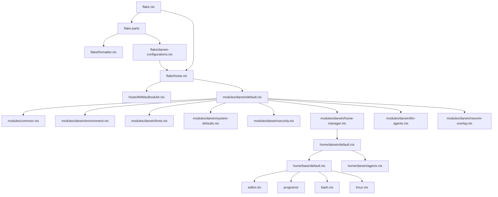

# Architecture

## モジュール依存関係

```mermaid
graph TD
    flake[flake.nix] --> parts[flake-parts]
    flake --> hostMap[flake/hosts.nix]
    parts --> formatter[flake/formatter.nix]
    parts --> darwinConfigurations[flake/darwin-configurations.nix]
    darwinConfigurations --> hostMap
    hostMap --> host[hosts/M4MacBookAir.nix]
    hostMap --> darwin[modules/darwin/default.nix]
    darwin --> common[modules/common.nix]
    darwin --> environment[modules/darwin/environment.nix]
    darwin --> fonts[modules/darwin/fonts.nix]
    darwin --> defaults[modules/darwin/system-defaults.nix]
    darwin --> security[modules/darwin/security.nix]
    darwin --> homeManager[modules/darwin/home-manager.nix]
    darwin --> agents[modules/darwin/llm-agents.nix]
    darwin --> neovimOverlay[modules/darwin/neovim-overlay.nix]
    homeManager --> darwinHome[home/darwin/default.nix]
    darwinHome --> baseHome[home/base/default.nix]
    darwinHome --> agenix[home/darwin/agenix.nix]
    baseHome --> editor[editor.nix]
    baseHome --> programs[programs/]
    baseHome --> bash[bash.nix]
    baseHome --> tmux[tmux.nix]
```

## 各層の役割

### flake.nix

リポジトリ全体のエントリーポイントにあたる。Flake の仕様上、静的に宣言する必要がある inputs と `nixConfig` を定義し、`flake-parts.lib.mkFlake` で出力モジュールを合成する。出力の具体的な定義は `flake/` に置く。

### flake/

Flake の出力に関する関心を分離する場所である。

- `hosts.nix` はホスト名と、そのホストを構成する nix-darwin モジュールを対応付ける。ホストを追加するときはここにエントリーを追加する
- `darwin-configurations.nix` は `hosts.nix` の定義から `darwinConfigurations` を生成し、全ホストに共通の `specialArgs` を渡す
- `formatter.nix` はシステムごとの `formatter` 出力を定義する

### hosts/

マシンごとのホスト固有設定を置く場所。`hostPlatform`、`hostName`、`primaryUser`、`stateVersion`、ユーザーアカウントなど、そのホストに紐づく情報だけを持つ。新しいマシンを追加するときは `hosts/<hostname>.nix` を作成し、`flake/hosts.nix` にエントリーを追加する。

### modules/

nix-darwin のシステムレベル設定を責務ごとに分割している。

- `modules/common.nix` は Nix 自体の基本設定を担当する。nix.enable、unfree 許可、タイムゾーンなどプラットフォーム非依存の設定をまとめている
- `modules/darwin/` は macOS 固有の設定を責務単位のファイルに分割している
  - `environment.nix` は `environment.pathsToLink` と `environment.shells` を設定する
  - `fonts.nix` は `fonts.packages` で Nerd Fonts をインストールする
  - `system-defaults.nix` は `system.defaults.*` (NSGlobalDomain, dock, finder, trackpad, menuExtraClock) を設定する
  - `security.nix` は Application Firewall、Touch ID による sudo 認証、Caps Lock のリマップを設定する
  - `home-manager.nix` は home-manager の nix-darwin 統合 (`useGlobalPkgs`, `backupFileExtension`, `extraSpecialArgs`, ユーザーエントリ) を定義する
  - `llm-agents.nix` は nix-index-database モジュールの import と Codex、OpenCode、Grok、codebase-memory-mcp などの LLM 開発支援ツールの systemPackages への注入を担当する
  - `neovim-overlay.nix` は neovim-nightly-overlay を `nixpkgs.overlays` に追加し、`pkgs.neovim-unwrapped` を nightly ビルドに差し替える

### home/base/

全プラットフォーム共通のユーザー環境設定を置く場所である。1 つの設定しか持たないディレクトリは作らず、関心ごとをファイルとして並べる。

- `editor.nix` は Neovim nightly、LSP、プラグイン、エディタ設定を管理する
- `programs.nix` は個別ツールの設定を束ねる。`programs/` には atuin、direnv、fzf、git、nh、ssh と CLI パッケージ一覧を置く
- `bash.nix` は Bash の設定を管理する。history は atuin が、Ctrl+G / Ctrl+W の fuzzy cd は fzf-tmux が担う
- `tmux.nix` は Tmux の設定を管理する (prefix は C-q)

### home/darwin/

darwin 固有の home-manager 設定を置く場所。state version と linkApps の設定を行い、`home/base/`、`agenix.nix`、`ghostty.nix` を import している。`agenix.nix` は agenix の home-manager モジュール、復号用の age 鍵のパス、関連 CLI パッケージを設定する。また、`secrets/secrets.nix` で `loadAsEnvironment` を有効にしたルールから復号対象を生成し、Bash の環境変数として読み込む。
