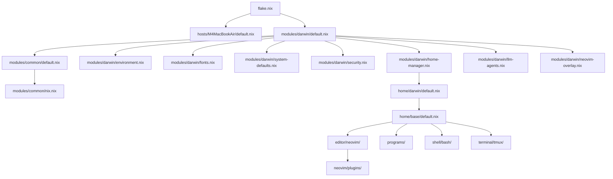

# Architecture

## モジュール依存関係

```mermaid
graph TD
    A[flake.nix] --> B[hosts/M4MacBookAir/default.nix]
    A --> C[modules/darwin/default.nix]
    C --> D[modules/common/default.nix]
    D --> D1[modules/common/nix.nix]
    C --> E1[modules/darwin/environment.nix]
    C --> E2[modules/darwin/fonts.nix]
    C --> E3[modules/darwin/system-defaults.nix]
    C --> E4[modules/darwin/security.nix]
    C --> E5[modules/darwin/home-manager.nix]
    C --> E6[modules/darwin/llm-agents.nix]
    C --> E7[modules/darwin/neovim-overlay.nix]
    E5 --> F[home/darwin/default.nix]
    F --> G[home/base/default.nix]
    G --> H[editor/neovim/]
    H --> L[neovim/plugins/]
    G --> I[programs/]
    G --> J[shell/bash/]
    G --> K[terminal/tmux/]
```

## 各層の役割

### flake.nix

リポジトリ全体のエントリーポイントにあたる。nixpkgs, nix-darwin, home-manager, neovim-nightly-overlay, llm-agents などの inputs を定義し、`darwinConfigurations.M4MacBookAir` を出力する。出力本体は `./hosts/M4MacBookAir` と `./modules/darwin` を import するだけの薄い骨格にとどめ、具体的な設定は各モジュール側に集約している。

### hosts/

マシンごとのホスト固有設定を置く場所。`hostPlatform`、`hostName`、`primaryUser`、`stateVersion`、ユーザーアカウントなど、そのホストに紐づく情報だけを持つ。新しいマシンを追加するときは `hosts/<hostname>/default.nix` を作成し、`flake.nix` の `darwinConfigurations` にエントリーを追加する。

### modules/

nix-darwin のシステムレベル設定を責務ごとに分割している。

- `modules/common/` は Nix 自体の基本設定を担当する。`nix.nix` に nix.enable、unfree 許可、タイムゾーンなどプラットフォーム非依存の設定をまとめている
- `modules/darwin/` は macOS 固有の設定を責務単位のファイルに分割している
  - `environment.nix` は `environment.pathsToLink` と `environment.shells` を設定する
  - `fonts.nix` は `fonts.packages` で Nerd Fonts をインストールする
  - `system-defaults.nix` は `system.defaults.*` (NSGlobalDomain, dock, finder, trackpad, menuExtraClock) を設定する
  - `security.nix` は Application Firewall、Touch ID による sudo 認証、Caps Lock のリマップを設定する
  - `home-manager.nix` は home-manager の nix-darwin 統合 (`useGlobalPkgs`, `backupFileExtension`, `extraSpecialArgs`, ユーザーエントリ) を定義する
  - `llm-agents.nix` は nix-index-database モジュールの import と `claude-code` の systemPackages への注入を担当する
  - `neovim-overlay.nix` は neovim-nightly-overlay を `nixpkgs.overlays` に追加し、`pkgs.neovim-unwrapped` を nightly ビルドに差し替える

### home/base/

全プラットフォーム共通のユーザー環境設定を置く場所で、以下のサブモジュールを持つ。

- `editor/neovim/` は Neovim nightly に LSP (gopls, nil, rust-analyzer, typescript-language-server) と各種プラグインを組み合わせた設定を管理している。プラグイン定義は `plugins/` サブディレクトリに分割されており、ui, completion, lsp, tools の 4 カテゴリで構成されている
- `programs/` は個別ツールの設定を管理している。`default.nix` はサブモジュールを束ねる import list のみ、`packages.nix` が CLI パッケージ一覧 (`home.packages`) を保持する。サブモジュールとして atuin, direnv, fzf, git, ssh が並ぶ
- `shell/bash/` は Bash の設定を管理している。history は atuin が、Ctrl+G / Ctrl+W の fuzzy cd は fzf-tmux が担う
- `terminal/tmux/` は Tmux の設定を管理している (prefix は C-q)

### home/darwin/

darwin 固有の home-manager 設定を置く場所。state version と linkApps の設定を行い、`home/base/` を import している。
