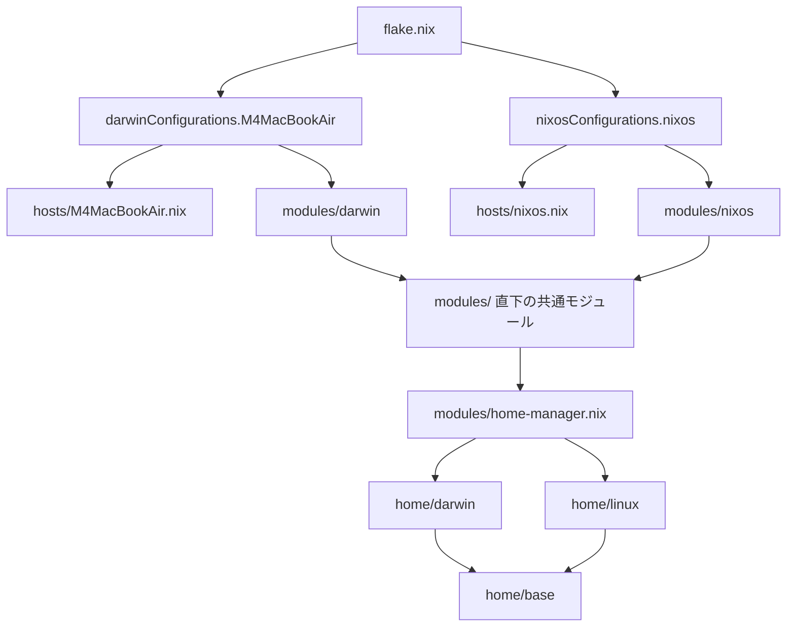

# Architecture

## 全体像

```mermaid
graph TD
    flake["flake.nix"] --> darwinCfg["darwinConfigurations.M4MacBookAir"]
    flake --> nixosCfg["nixosConfigurations.nixos"]
    darwinCfg --> darwinHost["hosts/M4MacBookAir.nix"]
    darwinCfg --> darwinMods["modules/darwin"]
    nixosCfg --> nixosHost["hosts/nixos.nix"]
    nixosCfg --> nixosMods["modules/nixos"]
    darwinMods --> commonMods["modules/ 直下の共通モジュール"]
    nixosMods --> commonMods
    commonMods --> hm["modules/home-manager.nix"]
    hm --> darwinHome["home/darwin"]
    hm --> linuxHome["home/linux"]
    darwinHome --> baseHome["home/base"]
    linuxHome --> baseHome
```

## flake.nix

リポジトリ全体のエントリーポイントである。inputs を宣言し、`flake-parts.lib.mkFlake` で出力を合成する。`flake` 属性に `darwinConfigurations` と `nixosConfigurations` を並べ、どちらも `hosts/<host>.nix` と対応する `modules/<os>` をモジュールリストに指定する。`specialArgs` では `inputs` に加えて `isDarwin` を渡し、共通モジュールが OS を判定できるようにしている。`imports` を `pkgs` で条件分岐すると `pkgs` の解決が config の評価を要求して循環するため、プラットフォームの判定はこの `specialArgs` に寄せている。

`perSystem` には `devShells`、`treefmt` (nixfmt)、`pre-commit` (actionlint、deadnix、statix) を定義する。

## Determinate Nix と FlakeHub

Nix の配布は両 OS とも Determinate Nix で、`modules/darwin/determinate.nix` と `modules/nixos/determinate.nix` が flake input の `determinate` モジュールを import する。FlakeHub の substituter、lazy-trees、並列評価、Determinate Nixd による自動 GC などの最適化と、OS ごとの構成方法は [determinate-nix.md](determinate-nix.md) にまとめている。

nixpkgs の input は FlakeHub の rolling チャンネル (`https://flakehub.com/f/NixOS/nixpkgs/0.1`) を指す。`nix-darwin`、`home-manager`、`agenix`、`neovim`、`nix-index-database`、`nix-secure-enclave-key`、`llm-agents` は `github:` 追従のままにしている。これらは活発に開発されているため、FlakeHub が公開するリリースが rolling nixpkgs より遅れて互換性を失うことがある。

## hosts/

マシンごとのホスト固有設定を置く場所である。`hostPlatform`、`hostName`、`my.primaryUser`、`stateVersion`、ユーザーアカウントなど、そのホストに紐づく情報だけを持つ。新しいマシンを追加するときは `hosts/<hostname>.nix` を作成し、`flake.nix` の対応する構成にエントリーを追加する。`my.primaryUser` は `modules/common.nix` が定義するオプションで、home-manager へ割り当てるユーザー名を OS に依存せず参照するために使う。

## modules/

システムレベルの設定を責務ごとのファイルに分割している。直下のファイルは全プラットフォーム共通で、`darwin/` と `nixos/` は OS 固有である。

### modules/ 直下の共通モジュール

- `common.nix` は unfree パッケージの許可、タイムゾーン、`my.primaryUser` オプションを定義する
- `environment.nix` は `environment.shells` に bashInteractive を設定する
- `fonts.nix` は JetBrainsMono Nerd Font をインストールする
- `llm-agents.nix` は `inputs.llm-agents` から grok を引いて systemPackages へ入れる
- `neovim-overlay.nix` は neovim-nightly-overlay を `nixpkgs.overlays` に追加し、`pkgs.neovim-unwrapped` を nightly ビルドに差し替える
- `tailscale.nix` は tailscaled を有効化する
- `home-manager.nix` は `isDarwin` に応じて home-manager の darwin / nixos モジュールを import し、`useGlobalPkgs`、`backupFileExtension`、`extraSpecialArgs` と `my.primaryUser` のユーザー割り当てを共通化する。`useUserPackages` は NixOS のときだけ有効にする

### modules/darwin

macOS 固有の設定を責務単位に分割している。

- `determinate.nix` は Determinate Nix の nix-darwin モジュールを import し、自動 GC の方針を宣言する
- `docker.nix` は colima を launchd エージェントとして起動する
- `environment.nix` は `environment.pathsToLink` に `/Applications` を加える
- `security.nix` は Application Firewall、Touch ID による sudo 認証、Caps Lock の Control へのリマップを設定する
- `system-defaults.nix` は `system.defaults.*` (NSGlobalDomain、dock、finder、trackpad、menuExtraClock) を設定する
- `tailscale.nix` は `services.tailscale.overrideLocalDns` を有効にし、MagicDNS に必要なローカル DNS の上書きを行う。Tailnet へのログインは `sudo tailscale up` で行い、認証のための Tailscale キーは管理しない

### modules/nixos

NixOS 固有の設定を責務単位に分割している。

- `determinate.nix` は Determinate Nix の NixOS モジュールを import する
- `agenix.nix` はシステム側の agenix を有効にし、`user-password` を root 所有で配備して `users.users.<user>.hashedPasswordFile` に渡す
- `boot.nix` は systemd-boot を設定する
- `docker.nix` は `virtualisation.docker` を有効にする
- `environment.nix` は mosh-server を非対話の SSH セッションからも使えるように systemPackages へ入れる
- `networking.nix` は NetworkManager とブリッジ (`br0`) のプロファイル、mosh 用の UDP ポート開放を設定する
- `nix.nix` は `nix.settings` (experimental-features、trusted-users) と `nix.optimise.automatic` を設定する。GC は Determinate Nixd が行うため `nix.gc.automatic` は設定しない
- `openssh.nix` は公開鍵認証のみの SSH サーバーを有効にする
- `tailscale.nix` は `tailscale-serve` サービスで dsh の Web UI を tailnet へ公開する。ポート番号は `home/linux/dsh-web.nix` の `dsh web` と揃える必要があり、手順は [dsh.md](dsh.md) を参照

## home/

home-manager によるユーザー環境である。

### home/base

全プラットフォーム共通の設定を置く。`default.nix` は各モジュールと nix-index-database の home モジュールを import し、`home.stateVersion` を定義する。

- `options.nix` は `my.ssh.identityFile` と `my.git.signingKey` のオプションを定義する
- `agenix.nix` は agenix の home-manager モジュールを import し、復号用の age 鍵のパス、関連 CLI パッケージ、`environmentSecrets` の対応表から生成する `age.secrets` と Bash の export 処理を設定する
- `editor.nix` は Neovim nightly、LSP、プラグイン、エディタ設定を管理する
- `locale.nix` は `LANG` を設定する
- `programs.nix` は個別ツールの設定を束ねる。`programs/` には atuin、direnv、fzf、git、nh、ssh と CLI パッケージ一覧を置く
- `bash.nix` は Bash の設定を管理する。history は atuin が、Ctrl+G / Ctrl+W の fuzzy cd は fzf-tmux が担う
- `tmux.nix` は Tmux の設定を管理する (prefix は C-q)。tmux-yank がシステムクリップボードへ書き込むため、Linux に限り xsel を導入する。macOS では tmux-yank が pbcopy を使うので追加のパッケージは要らない

### home/darwin

macOS 固有の home-manager 設定を置く。`ghostty.nix` は Ghostty の設定を、`secure-enclave-key.nix` は nix-secure-enclave-key の home-manager モジュールを import して Secure Enclave 内の鍵による Git の SSH 署名を、`docker.nix` は colima を導入する。`nh.nix` は launchd が `nh clean` の各オプションを個別の引数として渡すように `ProgramArguments` を上書きする。

### home/linux

Linux 固有の home-manager 設定を置く。`moshi-hook.nix` は Moshi の接続先ホストに必要な `moshi-hook` を導入する。このツールは nixpkgs にも `llm-agents.nix` にも存在せず、公式が配布するビルド済みバイナリしか提供されていないため、CDN のリリースを固定して取得する。あわせて `systemd.user.services.moshi-hook` を宣言的に定義し、公式の `moshi-hook service install` が命令的に書き込むユニットを世代管理の対象にする。接続手順は [moshi.md](moshi.md) を参照。

`dsh-web.nix` は `inputs.llm-agents` から `dsh` を導入し、`dsh web` を systemd ユーザーサービスとして常駐させる。Tailscale Serve は `Host` ヘッダをそのまま転送するため、起動時に tailscaled から MagicDNS 名を取り出して `--trusted-host` に渡す。公開は `modules/nixos/tailscale.nix` の `tailscale-serve` が担い、手順は [dsh.md](dsh.md) を参照。

## OS ごとの差異

共通化したうえで残る差異は次のとおりである。共通の仕組みを直下に置き、差異だけを OS 固有のファイルに閉じ込めている。

| 関心 | macOS | NixOS | 置き場所 |
| --- | --- | --- | --- |
| Nix の配布 | Determinate の nix-darwin モジュール。nix-darwin に nix.conf を管理させない | Determinate の NixOS モジュール。`nix.package` を差し替え、nix.conf を nix.custom.conf へリダイレクトする | `modules/darwin/determinate.nix`、`modules/nixos/determinate.nix` |
| Nix の設定 | Determinate Nixd に任せる。自動 GC を明示する | `nix.settings` と `nix.optimise.automatic` | `modules/darwin/determinate.nix`、`modules/nixos/nix.nix` |
| Docker | colima を launchd エージェントで起動する | `virtualisation.docker` を使う | `modules/darwin/docker.nix`、`modules/nixos/docker.nix` |
| ファイアウォール | Application Firewall で受信を遮断する | mosh 用に UDP 3610 と 60000-61000 を開放する | `modules/darwin/security.nix`、`modules/nixos/networking.nix` |
| 認証 | Touch ID による sudo、Caps Lock のリマップ | 公開鍵認証のみの SSH、パスワードは agenix の hashedPasswordFile | `modules/darwin/security.nix`、`modules/nixos/openssh.nix`、`hosts/nixos.nix` |
| ユーザー | `system.primaryUser` と `/Users/<user>` | uid 1000、isNormalUser、extraGroups、mutableUsers = false | `hosts/` |
| 常駐アプリ | colima、Ghostty | dsh-web、moshi-hook | `home/darwin/`、`home/linux/` |
| Git の署名鍵 | `~/.ssh/id_enclave_key` (Secure Enclave) | `~/.ssh/id_ed25519_signing` | `home/darwin/default.nix`、`home/linux/default.nix` |
| フォント、シェル、Neovim overlay、llm-agents | 共通 | 共通 | `modules/` 直下 |

## CI

`.github/workflows/ci.yml` は `DeterminateSystems/ci` の reusable workflow を `visibility: public` で呼び、FlakeHub Cache を使った評価とビルドを行う。`.github/workflows/auto-merge.yml` は dependabot の PR を自動マージし、`.github/dependabot.yml` は flake inputs をグループ化して毎日更新する。
