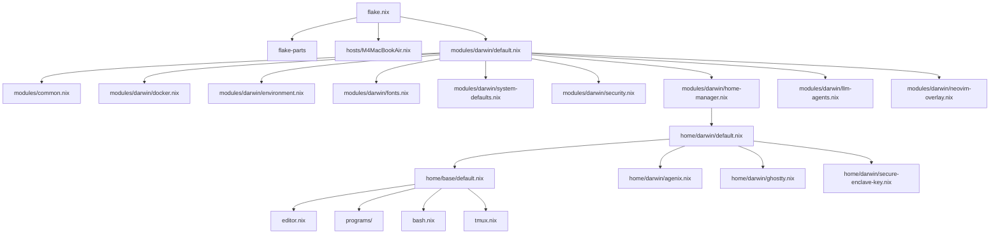

# Architecture

## モジュール依存関係

```mermaid
graph TD
    flake[flake.nix] --> parts[flake-parts]
    flake --> host[hosts/M4MacBookAir.nix]
    flake --> darwin[modules/darwin/default.nix]
    darwin --> common[modules/common.nix]
    darwin --> docker[modules/darwin/docker.nix]
    darwin --> environment[modules/darwin/environment.nix]
    darwin --> fonts[modules/darwin/fonts.nix]
    darwin --> defaults[modules/darwin/system-defaults.nix]
    darwin --> security[modules/darwin/security.nix]
    darwin --> homeManager[modules/darwin/home-manager.nix]
    darwin --> agents[modules/darwin/llm-agents.nix]
    darwin --> neovimOverlay[modules/darwin/neovim-overlay.nix]
    homeManager --> darwinHome[home/darwin/default.nix]
    darwinHome --> baseHome[home/base/default.nix]
    darwinHome --> agenix[home/darwin/agenix.nix]
    darwinHome --> ghostty[home/darwin/ghostty.nix]
    darwinHome --> secureEnclaveKey[home/darwin/secure-enclave-key.nix]
    baseHome --> editor[editor.nix]
    baseHome --> programs[programs/]
    baseHome --> bash[bash.nix]
    baseHome --> tmux[tmux.nix]
```

## 各層の役割

### flake.nix

リポジトリ全体のエントリーポイントにあたる。Flake の仕様上、静的に宣言する必要がある inputs と `nixConfig` を定義し、`flake-parts.lib.mkFlake` で出力を合成する。出力は flake.nix 内に直接定義しており、`git-hooks` と `treefmt-nix` の flake module を import したうえで、`flake` 属性に `darwinConfigurations` を、`perSystem` に `devShells`、`treefmt`、`pre-commit` を並べている。`darwinConfigurations` のモジュールリストには `hosts/M4MacBookAir.nix` と `modules/darwin` を指定し、`specialArgs` を通して inputs を渡している。

### FlakeHub cache

入力の配達と事前ビルド成果物の取得に FlakeHub のキャッシュを利用している。nixpkgs は、Determinate Nix がグローバルに登録した substituter (`https://cache.flakehub.com`) が有効になっており、`/etc/nix/nix.conf` の `extra-substituters` と FlakeHub の public key がその設定に含まれている。

inputs の参照方は flake ごとに切り分けている。

- `nixpkgs` は FlakeHub の rolling チャンネル (`https://flakehub.com/f/NixOS/nixpkgs/0.1`) を指す。これは以前の `github:NixOS/nixpkgs/nixpkgs-unstable` と同じ rolling 挙動を持ちながら、FlakeHub のキャッシュから事前ビルドを引けるようになっている。更新は `nix flake update nixpkgs` で行う
- `flake-parts`、`treefmt-nix`、`git-hooks` は FlakeHub の公開リリースにピン留めしている。これはビルド支援用の安定版であり、rolling nixpkgs と互換性が保たれている
- `nix-darwin`、`home-manager`、`agenix`、`neovim`、`nix-index-database`、`nix-secure-enclave-key`、`llm-agents` は `github:` 追従のままにしている。これらは活発に開発されているため、FlakeHub が公開するリリースが rolling nixpkgs より遅れて互換性を失うことがある

CI は `.github/workflows/flakehub-push.yml` がこの flake の出力 (`darwinConfigurations`、`devShells`) を FlakeHub のキャッシュへ発行する。`visibility: private` で非公開に保ち、`rolling: true` で `master` の最新状態を常にキャッシュへ反映している。

### hosts/

マシンごとのホスト固有設定を置く場所。`hostPlatform`、`hostName`、`primaryUser`、`stateVersion`、ユーザーアカウントなど、そのホストに紐づく情報だけを持つ。新しいマシンを追加するときは `hosts/<hostname>.nix` を作成し、`flake.nix` の `darwinConfigurations` にエントリーを追加する。

### modules/

nix-darwin のシステムレベル設定を責務ごとに分割している。

- `modules/common.nix` は Nix 自体の基本設定を担当する。nix.enable、unfree 許可、タイムゾーンなどプラットフォーム非依存の設定をまとめている
- `modules/darwin/` は macOS 固有の設定を責務単位のファイルに分割している
  - `docker.nix` は colima を launchd エージェントとして起動する設定を担当する
  - `environment.nix` は `environment.pathsToLink` と `environment.shells` を設定する
  - `fonts.nix` は `fonts.packages` で Nerd Fonts をインストールする
  - `system-defaults.nix` は `system.defaults.*` (NSGlobalDomain, dock, finder, trackpad, menuExtraClock) を設定する
  - `security.nix` は Application Firewall、Touch ID による sudo 認証、Caps Lock のリマップを設定する
  - `home-manager.nix` は home-manager の nix-darwin 統合 (`useGlobalPkgs`, `backupFileExtension`, `extraSpecialArgs`, ユーザーエントリ) を定義する
  - `llm-agents.nix` は Codex、Cursor Agent、Grok に加えて、ccusage と ren を systemPackages へ注入する
  - `neovim-overlay.nix` は neovim-nightly-overlay を `nixpkgs.overlays` に追加し、`pkgs.neovim-unwrapped` を nightly ビルドに差し替える

### home/base/

全プラットフォーム共通のユーザー環境設定を置く場所である。1 つの設定しか持たないディレクトリは作らず、関心ごとをファイルとして並べる。

- `editor.nix` は Neovim nightly、LSP、プラグイン、エディタ設定を管理する
- `programs.nix` は個別ツールの設定を束ねる。`programs/` には atuin、direnv、fzf、git、nh、ssh と CLI パッケージ一覧を置く
- `bash.nix` は Bash の設定を管理する。history は atuin が、Ctrl+G / Ctrl+W の fuzzy cd は fzf-tmux が担う
- `tmux.nix` は Tmux の設定を管理する (prefix は C-q)

### home/darwin/

darwin 固有の home-manager 設定を置く場所。state version と linkApps の設定を行い、`home/base/`、`agenix.nix`、`ghostty.nix`、`secure-enclave-key.nix` と nix-index-database の home module を import している。`agenix.nix` は agenix の home-manager モジュール、復号用の age 鍵のパス、関連 CLI パッケージを設定する。また、`environmentSecrets` の対応表から配備する暗号化ファイルと Bash へ export する環境変数を生成する。`secure-enclave-key.nix` は nix-secure-enclave-key の home-manager モジュールを import し、Secure Enclave 内の鍵による Git の SSH 署名を設定する。
