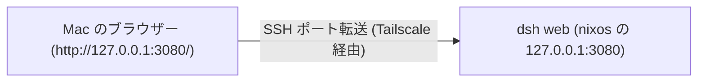

# Tailscale 経由の DeepSeek Harness

DeepSeek Harness (`dsh`) はエージェントハーネスで、`dsh web` がブラウザー用の UI を提供する。このホストでは shiguredo の fork をビルドし、systemd サービスとしてループバックで動かす。fork は日本語ロケール、フォント設定、ブランチ表示、Ollama Cloud 対応を追加したものである。使うときは Mac 側の SSH ポート転送でその loopback に届かせ、tailnet は SSH の経路としてだけ使う。

## 構成



`modules/nixos/dsh-web.nix` が fork のビルドとサービスの定義を持つ。`dsh web` を引数なしで起動するので、待ち受けるのは既定の 127.0.0.1:3080 である。

## ループバックに閉じる理由

dsh のブラウザー UI は、ページの origin がループバックのときだけ Host の設定文書を読む。tailnet の名前や IP で開くと設定はページ内のメモリに閉じ、Settings の Models が `settings are unavailable in this browser` を返し、API キーの初期設定も出てこない。つまりプロバイダーを設定できず、エージェントを動かせない。

判定に使われるのはページの URL の hostname だけである (`packages/client/connection/src/client/index.ts` の `isLoopback`)。`127.0.0.1`、`localhost`、`::1` と `127/8` だけがループバックと見なされ、MagicDNS 名は含まれない (2026-10-08 に実機のブラウザーで両方の origin を比べて確認した。tailnet の名前では Settings の Models が失敗し、`127.0.0.1` では API キーの設定画面が出る)。リバースプロキシを挟んでもブラウザーの origin は変えられないため、プロキシ経由では設定できない。

## 使い方

サービスは 127.0.0.1:3080 で待ち受け、起動のたびにトークン付きの URL をジャーナルへ出す。まずそれを取り出す。

```bash
sudo journalctl -u dsh-web | grep "dsh web:"
```

Mac 側で同じポートへ転送し、表示された URL をそのまま開く。

```bash
ssh -N -L 3080:127.0.0.1:3080 nixos.tail9103a.ts.net
```

URL は `http://127.0.0.1:3080/?token=...` の形である。トークンを引き換えると authority (ホストとポート) に紐付いた署名付き Cookie が発行され、以降のリクエストはこれで認証される。転送先のポートを変える場合は、URL のポートも読み替える。

初回は Settings の Models で API キー (DeepSeek または Ollama Cloud) を設定し、Choose workspace から作業対象のディレクトリを追加する。セッションやログ、プロファイルは `~/.dsh` に置かれ、サービスは `my.primaryUser` として動く。`dsh` コマンド自体も systemPackages に入っているので、SSH から直接使える。rootless Docker の socket は `DOCKER_HOST` としてサービスにも渡している。

## ビルドと更新

- fork の改訂は `nix flake update deepseek-harness` で取り込み、`sudo nixos-rebuild switch --flake .#nixos` で反映する
- 実行には公式の Node.js (nodejs.org が配布する tarball) を使う。nixpkgs の node は静的にリンクされており、dsh が起動時に使う `node-addon-require-builtin` が必要とする V8 の内部シンボルを持たないため、`Unsupported/no-getter` で起動に失敗する
- ビルドはリポジトリ全体をビルドするので store の消費が大きい。`nix flake update deepseek-harness` のたびに作り直しになる

## 検討した代替案

| 案 | 採否 | 理由 |
| --- | --- | --- |
| ループバックで待ち受け、Mac 側で SSH ポート転送 | 採用 | ブラウザーの origin が loopback になり、設定文書と API キーの設定が使える |
| nginx をホストで動かし tailnet の名前で公開 | 不採用 | origin が MagicDNS 名になるため設定文書が読めず、Settings の Models と API キーの設定が使えない (実測) |
| `tailscale serve` | 不採用 | この tailnet では HTTPS 証明書が有効になっていない (`CertDomains` が空) ため TLS を提供できない。設定も tailscaled の状態として保存され、Nix の宣言的な設定から外れる |
