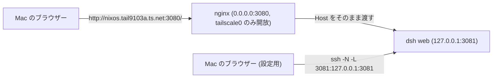

# Tailscale 経由の DeepSeek Harness

DeepSeek Harness (`dsh`) はエージェントハーネスで、`dsh web` がブラウザー用の UI を提供する。このホストでは shiguredo の fork をビルドし、systemd サービスとしてループバックで動かす。tailnet 側の窓口は nginx が担い、`http://nixos.tail9103a.ts.net:3080/` で開ける。fork は日本語ロケール、フォント設定、ブランチ表示、Ollama Cloud 対応を追加したものである。

## 構成



`modules/nixos/dsh-web.nix` がこの仕組み全体を管理する。fork のビルド、実行用の公式 Node.js の導入、`dsh web` の起動、nginx による中継、tailscale0 だけを対象にしたファイアウォールの開放がそこに書かれている。

dsh は `--host 0.0.0.0` を安全性のために拒否する (「it would expose remote code execution to the network; use 127.0.0.1 instead」)。そのため dsh はループバックで動かし、tailnet 側の窓口は nginx が担う。nginx はブラウザーが送った Host をポートごとそのまま渡す。dsh が発行する Cookie は URL の authority (ホストとポート) に紐付くため、ポートを落とすと 401 になる。

## 2 つの面

| 面 | URL | できること |
| --- | --- | --- |
| tailnet | `http://nixos.tail9103a.ts.net:3080/` | UI の閲覧、セッションの操作 |
| ループバック | `http://127.0.0.1:3081/` (SSH ポート転送) | 上に加えて Settings と API キーの設定 |

dsh のブラウザー UI はページの origin がループバックのときだけ Host の設定文書を読む。tailnet の名前で開いた画面では設定がページ内のメモリに閉じ、Settings の Models が `settings are unavailable in this browser` を返し、API キーの初期設定も出てこない。判定はページの URL の hostname だけで行われ (`packages/client/connection/src/client/index.ts` の `isLoopback`)、`127.0.0.1`、`localhost`、`::1` と `127/8` 以外は非特権になる (2026-10-08 に実機のブラウザーで両方の origin を比べて確認した)。upstream の master にも同じ判定があるため、プロキシの設定では変えられない。

そこでプロバイダーの API キーはループバックの面で設定する。設定はホストの `~/.dsh` に保存され、tailnet の面のセッションもそのまま使う。

## 使い方

サービスは起動のたびにトークン付きの URL をジャーナルへ出す。tailnet の面はこれをそのまま開けばよい。

```bash
sudo journalctl -u dsh-web | grep "dsh web:"
```

設定を行うときは、Mac 側でループバックへ転送し、同じトークンを `127.0.0.1` の URL で使う。ジャーナルに出た URL の host と port を `127.0.0.1:3081` に読み替えて開く。

```bash
ssh -N -L 3081:127.0.0.1:3081 nixos.tail9103a.ts.net
```

初回は Settings の Models で API キー (DeepSeek または Ollama Cloud) を設定し、Choose workspace から作業対象のディレクトリを追加する。セッションやログ、プロファイルは `~/.dsh` に置かれ、サービスは `my.primaryUser` として動く。`dsh` コマンド自体も systemPackages に入っているので、SSH から直接使える。rootless Docker の socket は `DOCKER_HOST` としてサービスにも渡している。

## ビルドと更新

- fork の改訂は `nix flake update deepseek-harness` で取り込み、`sudo nixos-rebuild switch --flake .#nixos` で反映する
- 実行には公式の Node.js (nodejs.org が配布する tarball) を使う。nixpkgs の node は静的にリンクされており、dsh が起動時に使う `node-addon-require-builtin` が必要とする V8 の内部シンボルを持たないため、`Unsupported/no-getter` で起動に失敗する
- ビルドはリポジトリ全体をビルドするので store の消費が大きい。`nix flake update deepseek-harness` のたびに作り直しになる

## 検討した代替案

| 案 | 採否 | 理由 |
| --- | --- | --- |
| nginx で tailnet に公開し、ループバックでも開けるようにする | 採用 | dsh 自身は `0.0.0.0` を拒否するため tailnet の窓口にはプロキシが要る。設定はループバックの面で行う |
| `--host 0.0.0.0` で直接公開する | 不採用 | CLI が安全性を理由に拒否する (実測。エラー文は上に引用した) |
| `tailscale serve` | 不採用 | この tailnet では HTTPS 証明書が有効になっていない (`CertDomains` が空) ため TLS を提供できない。設定も tailscaled の状態として保存され、Nix の宣言的な設定から外れる |
| SSH ポート転送だけで済ませる | 不採用 | 設定はすべて使えるが、Mac 以外の端末やブラウザーから開けない (2026-10-08 に一度この形にして、tailnet から開けるように戻した) |
| tailnet の名前でも設定を書けるように patch する | 不採用 | upstream が「ループバックは操作者のマシン」として引いている信頼の境界を越える。fork の追従も重くなる |
