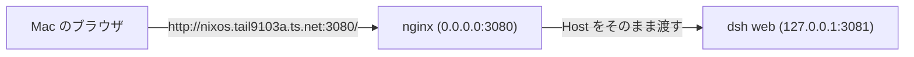

# Tailscale 経由の DeepSeek Harness

DeepSeek Harness (`dsh`) はエージェントハーネスで、`dsh web` がブラウザ用の UI を提供する。このホストでは shiguredo の fork をビルドして systemd サービスとして動かし、Tailscale の tailnet からだけ届くようにしている。fork は日本語ロケール、フォント設定、ブランチ表示、Ollama Cloud 対応を追加したものである。

## 構成



`modules/nixos/dsh-web.nix` がこの仕組み全体を管理する。fork のビルド、実行用の公式 Node.js の導入、`dsh web` の起動、nginx による中継、tailscale0 だけを対象にしたファイアウォールの開放がそこに書かれている。

dsh が待ち受けられるアドレスは `127.0.0.1` と `0.0.0.0` だけで、`--host 0.0.0.0` は CLI が明示的に拒否する。そのため dsh はループバックで動かし、tailnet 側の窓口は nginx が担う。nginx はブラウザが送った Host ヘッダをそのまま dsh に渡す。これは dsh が発行する Cookie が URL の authority (ホストとポート) に結び付いているためである。

ポート 3080 は tailscale0 でだけ開放している。LAN 側のインターフェースや tailnet 以外の経路からは届かない。

## 使い方

サービスが起動すると、トークン付きの URL がジャーナルに出力される。まずこれを取り出す。

```bash
sudo journalctl -u dsh-web | grep "dsh web:"
```

表示された URL をそのまま Mac のブラウザで開く。URL は `http://nixos.tail9103a.ts.net:3080/?token=...` の形で、トークンはサービスを起動するたびに変わる。トークンを引き換えると署名付きの Cookie が発行され、以降のリクエストはこれで認証される。Cookie は authority に結び付くので、IP アドレスではなく MagicDNS 名で開く。

初回は Settings の Models で API キー (DeepSeek または Ollama Cloud) を設定し、Choose workspace から作業対象のディレクトリを追加する。

セッションやログ、プロファイルは `~/.dsh` に置かれる。`dsh` コマンド自体も systemPackages に入っているので、SSH から直接使える。

## ビルドと更新

- fork の改訂は `nix flake update deepseek-harness` で取り込み、`sudo nixos-rebuild switch --flake .#nixos` で反映する
- 実行には公式の Node.js (nodejs.org が配布する tarball) を使う。nixpkgs の node は静的にリンクされており、dsh が起動時に使う `node-addon-require-builtin` が必要とする V8 の内部シンボルを持たないため、`Unsupported/no-getter` で起動に失敗する
- サービスの実行ユーザーは `my.primaryUser` で、`~/.dsh` をそのまま使う。rootless Docker の socket も `DOCKER_HOST` として渡している

## tailscale serve を使わない理由

`tailscale serve` でも tailnet に Web UI を公開できるが、この tailnet では HTTPS 証明書が有効になっていない (`CertDomains` が空) ため TLS を提供できない。また serve の設定は tailscaled の状態として保存され、Nix の宣言的な設定からは外れる。nginx の構成はすべて Nix に書けるので、`nixos-rebuild switch` だけで再現できる。
