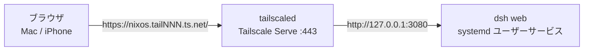

# dsh の Web UI を Tailscale 経由で使う

dsh (DeepSeek Harness) は DeepSeek AI が開発する AI エージェントハーネスである。`dsh web` はブラウザからエージェントを操作するための Web UI を起動する。ここでは、このフレーク管理下の NixOS ホストで Web UI を常駐させ、Tailscale Serve で tailnet 内にだけ公開する構成を説明する。

## 構成



- `home/linux/dsh-web.nix` は `llm-agents.nix` から `dsh` を導入し、`dsh web` を systemd ユーザーサービス (`dsh-web`) として常駐させる。Web UI は loopback の 3080 番ポートだけで待ち受ける
- `modules/nixos/tailscale.nix` は tailscaled を有効化し、`tailscale-serve` サービスで `tailscale serve --bg 3080` を実行する。これにより tailnet の `https://<MagicDNS 名>/` へのアクセスが loopback の 3080 番ポートへ転送される
- ポート番号は両方のファイルに現れる。変更するときは揃える

## 使い方

### サービスの状態を確認する

```bash
systemctl --user status dsh-web
systemctl status tailscale-serve
tailscale serve status
```

`tailscale-serve` は起動時に一度だけ serve 設定を書き込む。tailscaled がログインしていない間は失敗するため、10 秒間隔で再試行する。serve 設定自体は tailscaled の状態に保存されるので、再起動しても設定は残る。設定を消すときは `sudo tailscale serve reset` を実行する。

### ブラウザからアクセスする

起動時にサービスと dsh が出力する行を journal から取得する。

```bash
dsh-web-url
```

`dsh-web-url` は `home/linux/dsh-web.nix` が定義する関数で、journal からトークンを、tailscaled から MagicDNS 名を取り出して、開くべき URL を出力する。1 行目が tailnet 用、2 行目が SSH ポートフォワードで loopback として開くとき用である。同じ内容は次のコマンドでも得られる。

```bash
journalctl --user -u dsh-web -o cat | grep '^dsh'
```

```text
dsh-web: https://nixos.tailNNN.ts.net/ で tailnet へ公開する
dsh web: http://127.0.0.1:3080/?token=XXXXX
```

1 行目は tailnet 側の URL、2 行目は dsh が出力する loopback 側の URL である。ブラウザで開くのは tailnet 側の URL に 2 行目の `?token=...` を付けたもので、開くとセッションの cookie が発行され、以降は素の URL でアクセスできる。cookie はサービスの再起動をまたいで有効なので、トークン付きの URL を開くのは cookie が切れたときだけでよい。`dsh web --no-open` で起動しているため、ブラウザは自動では開かない。

### モデルを設定する

Settings → Models は Tailscale Serve 経由では使えない (理由は「モデルと API キーの設定」を参照)。プロバイダの API キーはホスト側で設定する。

## --trusted-host に MagicDNS 名を渡している理由

dsh の `/api` は、リクエストの `Host` ヘッダが loopback か `--trusted-host` で宣言した authority と一致することを要求する。これは DNS リバインディングとクロスサイトリクエストに対する防御である。

Tailscale Serve はバックエンドへ転送するとき `Host` ヘッダをそのまま渡すため、tailnet から届いたリクエストの `Host` は `nixos.tailNNN.ts.net` になる。loopback でないこの authority を許可するには `--trusted-host` が必要で、指定しないと API 呼び出しがすべて 403 になる。Web UI の HTML 自体は返るため、画面は表示されるが操作はできない。

MagicDNS 名は tailnet ごとに異なるため、`dsh-web` サービスは起動時に `tailscale status --json` から `.Self.DNSName` を読み取り、末尾のドットを除いた名前を `--trusted-host` に渡す。tailscaled が起動していない場合は名前を取得できるまで待ち、取得できないままなら起動を失敗させて systemd の再起動に任せる。

## 公開範囲と認証

`tailscale serve` は tailnet 内にだけ公開する。インターネットへ公開する `tailscale funnel` は使わない。

Web UI の `/api` はすべてブラウザセッションで認証され、セッションを持たないリクエストは 401 になる。セッションは起動時に生成されるトークンを `?token=...` として一度開くことで cookie として発行され、有効期限は 30 日である。トークンはプロセスごとに変わるが cookie は残るため、再起動のたびに開き直す必要はない。cookie は authority (ホスト名とポート) に紐づくので、loopback で得た cookie を tailnet 側の URL で使い回すことはできない。

dsh 0.1.1-rc.2 以前はこの認証が無く、代わりに設定と credential のメソッド (`settings.describe` や `credentials.describe` など) を loopback の Host に限定していた。Tailscale Serve 経由の Host は tailnet 名になるため、これらのメソッドは 403 になり、Settings → Models が失敗する。0.1.5-rc.2 ではこの制限が無くなり、代わりにセッション認証が全 API に掛かる。そのため llm-agents の入力は 0.1.5-rc.2 以降へ更新している。

Web UI を操作できる相手は、セッションを持っている相手、すなわちトークン付きの URL を知っている相手である。tailnet に他のユーザーの端末が参加している場合は、Tailscale の ACL でこのホストの 443 番ポートへの到達を絞る。

## モデルと API キーの設定

設定と credential の領域は loopback に限定されている。ブラウザ側がページ自身のホスト名から loopback かどうかを判定し、loopback でなければ設定の describe を行わない。Tailscale Serve 経由の URL は loopback ではないため、Settings → Models は `Loading the provider directory failed: settings are unavailable in this browser` となり、API キーを Web UI から登録できない。これは `--trusted-host` や dsh のバージョンでは変わらない制約である。

プロバイダの API キーはホスト側で設定する。次のどちらかを使う。

- `~/.dsh/.env` に `DEEPSEEK_API_KEY=...` を書く。環境変数としてサービスから見えるようになる。反映には `systemctl --user restart dsh-web` でサービスを再起動する。Moshi や SSH で携帯からホストへ入ればこの方法だけで完結する
- SSH ポートフォワードで loopback に接続し、Web UI から登録する。登録内容はホストの credential ストア (`~/.dsh/.credentials.yaml`) に保存され、tailnet 側から開始したセッションでも使われる

```bash
# シェルは不要なので -N で転送だけ行う。付けないと対話シェルが即座に終了することがある
ssh -N -L 3080:127.0.0.1:3080 nixos.tailNNN.ts.net
```

ポートフォワードを張った状態で、`dsh-web-url` が 2 行目に出力する loopback 側の URL を開くと、loopback として扱われるため Settings → Models が使える。

一方、モデルのカタログ (`llm/listProviders` など) は trusted host でも許可されるので、tailnet 側の UI でもモデルの選択とセッションの実行ができる。ワークスペースの選択も Web UI 上のディレクトリ選択で完結する。

### プロバイダとモデルの設定

Models ページは `$DSH_HOME/profiles/web/cordis.patch.yml` を書き換えているだけなので、この文書を直接編集しても同じ設定になる。公式ガイドによれば編集は次のリクエストから反映され、再起動は要らない。このファイルは `home/linux/dsh-web.nix` の `profilePatch` から生成しており、Ollama Cloud の `deepseek-v4.1-flash` をプロバイダ `ollama` として登録し、新しいセッションの既定モデルにも指定している。

```yaml
- id: llm-pi-ai
  config:
    providers:
      ollama:
        displayName: Ollama Cloud
        apiKeyEnv: OLLAMA_API_KEY
        api: openai-completions
        baseURL: https://ollama.com/v1
        models:
          - id: deepseek-v4.1-flash
            name: DeepSeek V4.1 Flash
            contextWindow: 1310720
```

API キーは設定ファイルに書かない。agenix の `ollama-api-key` は `$XDG_RUNTIME_DIR/agenix/` へ復号される。この path は `$XDG_RUNTIME_DIR` をシェルで展開する前提の文字列で、systemd の `Environment=` では展開されないため、ラッパーが実行時に組み立てて読み、`OLLAMA_API_KEY` として export する (`apiKeyEnv` が参照する変数)。復号は `agenix.service` が行うので `dsh-web` は `After=agenix.service` で順序を取り、それでもファイルが無い場合は 60 秒待って警告を出し、Web UI 自体は起動する (モデル呼び出しだけが credential エラーになる)。

```bash
# 疎通確認 (ホスト上で)
DSH_HOME=$(mktemp -d) dsh --profile headless "Reply with exactly: ok"
```

DeepSeek 公式プロバイダは既定で `apiKeyEnv: DEEPSEEK_API_KEY` を参照するため、`~/.dsh/.env` にキーを置けばそちらも使える。別の OpenAI 互換プロバイダを足すときは `providers` に同じ形で並べる。

既存のエントリを書き換えるときは、そのエントリの設定全体を置き換える点に注意する (他のプロバイダやフィールドを消さないよう、残す項目も書く)。

この文書は dsh 自身も書き換える。Models ページで保存するとストアへの symlink は実ファイルに置き換わり、以降は Nix の管理から外れる。手で編集した場合も同じで、編集内容は次の switch で `hm-backup` へ退避される。

## 参考

- [DeepSeek Harness (GitHub)](https://github.com/deepseek-ai/deepseek-harness)
- [Web UI ガイド](https://deepseek-harness.github.io/deepseek-harness/)
- [Tailscale Serve のドキュメント](https://tailscale.com/kb/1242/tailscale-serve)
- [Tailscale 経由の mosh 接続](tailscale-mosh.md)
