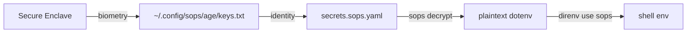

# 開発環境変数の管理

このドキュメントでは、sops と age、そして Apple Secure Enclave に鍵を委ねる age-plugin-se を組み合わせて、プロジェクトごとの開発環境変数を安全に持ち運ぶ手順をまとめる。

## 全体像



リポジトリには sops で暗号化したファイル (`secrets.sops.yaml` など) のみをコミットし、復号鍵そのものはマシン外には出ない。直接の復号鍵は Secure Enclave に格納されており、`~/.config/sops/age/keys.txt` にはそのハンドルだけが置かれる。Touch ID で認証するたびに Secure Enclave 内で復号が行われ、平文の鍵はメモリ上にも残らない。

## 提供されるもの

`home/base/programs/sops/default.nix` が次の 3 点を提供する。

- `sops`、`age`、`age-plugin-se` の 3 つの CLI を `home.packages` でインストールする
- `SOPS_AGE_KEY_FILE` を `~/.config/sops/age/keys.txt` に固定する `home.sessionVariables` を設定する
- direnv の stdlib に `use_sops` ヘルパーを追加し、`.envrc` から `use sops` で呼び出せるようにする

## 初期セットアップ

新しいマシンでは、age-plugin-se で identity を生成する必要がある。1 度きりの作業なので flake では自動化していない。

```bash
mkdir -p ~/.config/sops/age
age-plugin-se keygen \
  --access-control any-biometry-and-passcode \
  -o ~/.config/sops/age/keys.txt
```

`--access-control` の選択肢はいくつかあるが、ここでは Touch ID と passcode の両方を要求する `any-biometry-and-passcode` を推奨する。生成された `keys.txt` の冒頭コメントには対応する公開鍵 (`age1se1...` で始まる recipient) が記載されている。これが暗号化先の宛先になる。

`keys.txt` は Secure Enclave への参照しか持たないが、コミットすると鍵の利用範囲が広がってしまうため commit してはいけない。

## プロジェクトでの使い方

### 1. リポジトリ直下に `.sops.yaml` を置く

```yaml
creation_rules:
  - path_regex: secrets\.sops\.ya?ml$
    age: age1se1qg... # age-plugin-se で生成した recipient をここに貼る
```

複数の開発者で共有する場合は、各人の recipient を `age:` にカンマ区切りで列挙する。

### 2. `secrets.sops.yaml` を作って暗号化する

```bash
sops edit secrets.sops.yaml
```

エディタが開くので、平文の dotenv 形式ではなく YAML として平坦に書く。

```yaml
DATABASE_URL: postgres://...
API_KEY: xxx
```

保存すると sops が自動で暗号化し、ファイル内の各 value だけが ENC[AES256_GCM,...] に置き換わる。キー名と構造は平文のままなので diff が読みやすい。

### 3. `.envrc` で読み込む

```bash
use sops
# あるいは明示的にパスを指定する
# use sops secrets.sops.yaml
```

`direnv allow` すると、cd した瞬間に Touch ID プロンプトが出て、復号された値が環境変数として export される。`secrets.sops.yaml` を `watch_file` しているので、暗号化ファイルを更新すれば自動で再読み込みされる。

## 持ち運びと共有

- 暗号化済みファイル (`secrets.sops.yaml`, `.sops.yaml`) はそのまま VCS にコミットして問題ない
- 別マシンで開発する場合は、そのマシンでも `age-plugin-se keygen` を行って recipient を `.sops.yaml` に追記し、`sops updatekeys secrets.sops.yaml` で再暗号化する
- recipient を失効させたい場合は `.sops.yaml` から削除し、同じく `sops updatekeys` を走らせる
